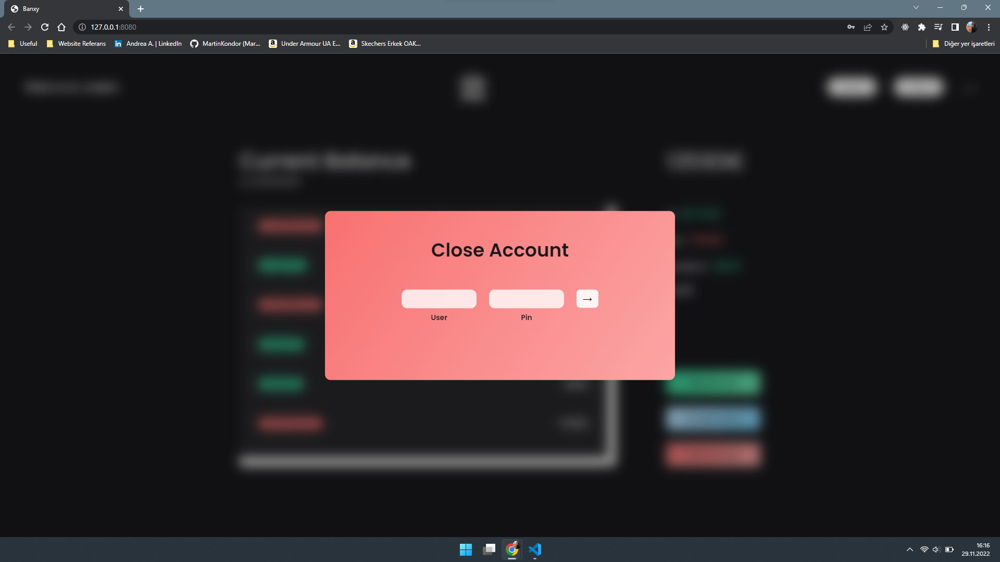

# Banxy App

A modern, minimalistic bank app created with Vanilla JavaScript and Plain CSS

## Functionality

- The application has essential functionalities such as transfering money, requesting loan, entering to account, deleting the account
- Datas are displayed beautifully with power of ES6 array methods and some magical CSS
- The application is still in development and there is a lot more to come

## Preview

You can see the live demo  [here](https://muasevim.github.io/bank-app/) !

#### General Look

#### Transfering Money

#### Closing Account

#### Requesting Loan

